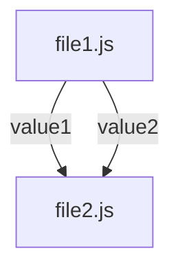
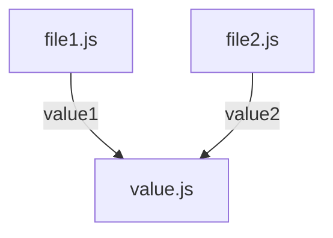

#  cycle-import-check

> circular dependency check tool for javascript modules

[](https://github.com/Soontao/cycle-import-check/actions?query=workflow%3A%22Multi-Version+Test%22)
[](https://codecov.io/gh/Soontao/cycle-import-check)
[](https://www.npmjs.com/package/cycle-import-check)

ES6 circular import check tool, support `js`, `ts`, `jsx`, `tsx` and `mjs` files, and will ignore all `node_modules` files.

Support `import`, `export` keywords and `require()`, `import()` function now

## Why do we need this tool ?

In javascript ES6 standard, people use `import` & `export` keyword in modules, but if js files circular import each other, some exported objects will be `undefined` in runtime.

The best practice is **one-way dependency**, and I wrote this tool to ensure no circular-dependency in projects.

## Circular dependency sample project

Let's look at a circular dependency example: 

> file1.js

```javascript
// and console will be first triggered in file2
import { value2 } from "./file2"; 
// file2 is fully imported
export const value1 = "value1"
// value2 is 'value2'
console.log("value2 in file1: " + value2) 
setTimeout(() => {
  // value2 is 'value2'
  console.log("delay 200ms, value2 in file1: " + value2)
}, 200)

// file1 is fully executed now
```

> file2.js

```javascript
import { value1 } from "./file1"; 
// file1 is not fully executed, just ref with cache
export const value2 = "value2"  
// value1 is undefined
console.log("value1 in file2: " + value1) 
setTimeout(() => {
  // file1 is executed now
  console.log("delay 200ms, value1 in file2: " + value1) // value1 is 'value1'
}, 200)

```

```bash
> babel-node --presets es2015 file1.js

value1 in file2: undefined
value2 in file1: value2
delay 200ms, value1 in file2: value1
delay 200ms, value2 in file1: value2

```

If we only have two js files, it's easy to determine wether scripts have circular dependencies.

However, if we have a large project with thousands of files, it's hard to do that.

So, this tool appeared, using old (but efficient) graph algorithms to check for circular dependency.

## How to resolve circular dependency ?

Just extract shared variables/functions into an independent file: 

`from`




`to`




## Usage

```bash
npx cycle-import-check [a directory path]
```

> detected

```text

> iscan tests/testproject4

Circular dependency existed in tests/testproject4

cycle 1, size (2):

  tests/testproject4/file2.js
  tests/testproject4/file1.js

```

> normal

```text

> iscan tests/testproject2

Congratulation! Not found circular dependency in tests/testproject2

```

## [CHANGELOG](./CHANGELOG.md)

## [LICENSE (MIT)](./LICENSE)
